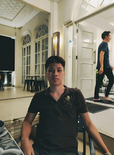

<!DOCTYPE html>
<html lang="id">
<head>
    <meta charset="UTF-8">
    <meta name="viewport" content="width=device-width, initial-scale=1.0">
    <title>Blog Pribadi Saya</title>
    
</head>
<body>

<header>
    <h1>Welcome</h1>
</header>

<nav>
    <a href="#home">Home</a>
    <a href="#about">About</a>
    <a href="#contact">Contact</a>
</nav>

    <section id="home">
        <article>
            <h2>Hello,</h2>
            
Welcome To my Blog.

            <h3>Photo</h3>
            
            <h3>Video</h3>
            <video controls>
                <source src="TEAM 1.mp4" type="video/mp4">
                Browser Anda tidak mendukung tag video.
            </video>
        </article>
    </section>

    <section id="about">
        <article>
            <h2>About Me</h2>
            
Hi, I'm David Jonathan Sekeh and usually called David, and now I will tell about myself.
                I was born in Manado on June 9, 2005, grew up in Tomohon but when I was little I often 
                stayed in Tembagapura, Papua with my grandparents who worked there. When I grew up, I lived in 
                Tomohon city until now. I graduated from Christian Vocational High School 1 Tomohon and I 
                am currently studying and becoming a student at Politeknik Negeri Manado with a major in 
                electrical engineering in the informatics engineering study program. After I graduate, 
                I hope to work in a place that suits my passion. But for now, I hope to get a job even if 
                it's just a part-time job to fill my free time or holidays later.
            

        </article>
    </section>

    <section id="contact">
        <article>
            <h2>Contact</h2>
            
Anda bisa menghubungi saya di email@example.com.

        </article>
    </section>

<footer>
    
Blog Pribadi Saya &copy; 2024</footer>

</body>
</html>
